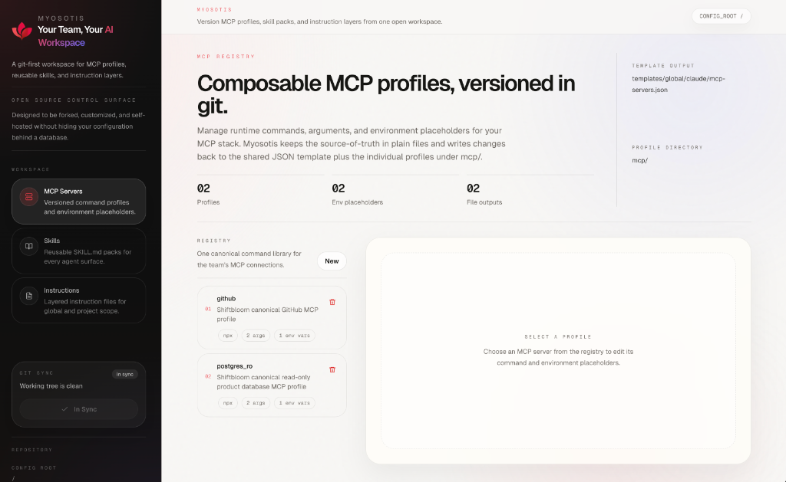

# Myosotis


[](./LICENSE)
[](https://nextjs.org/)
[](https://www.typescriptlang.org/)
[](./compose/docker-compose.yml)
[](./infra/terraform/aws)

Myosotis is an open-source control surface for AI-native workspace setup. 

**This is not another agent harness.**

Its purpose is to solve **Configuration Fragmentation** and **Team-Wide Onboarding** in an era where AI skills, MCP servers, and best practices are releasing minutely. It provides a unified, syncable baseline for every developer on a team—ensuring every agent has the same tools and domain context while preserving local autonomy.

## Why Myosotis?

Instead of hiding your agent setups behind a database or a proprietary internal tool, Myosotis keeps the source of truth in **plain files** you can review, diff, fork, and ship.

- **Instant Team Onboarding**: Turn hours of manual agent configuration into a 60-second bootstrap.
- **Collective Intelligence**: Shared domain skills (backend, frontend, devops, pr-review) that the whole team uses and improves.
- **File-Native**: MCP configs, skills, and instructions remain regular repository assets.
- **Hybrid Execution**: A shared stack on AWS for long-running team workflows, mirrored by local developer environments.
- **Project Anchors**: Consistent `.archon/`, `AGENTS.md`, and `CLAUDE.md` files synchronized into every product repo.

## Control Surface

Myosotis includes a Next.js-based control surface that lets you manage your AI workspace visually while keeping the source of truth in git.



## Repository Layout

- `web/` Next.js application for the Myosotis workspace
- `compose/` Docker Compose runtime and deployment helpers
- `infra/terraform/aws/` AWS scaffold for EC2, RDS, Secrets Manager, and SSM
- `templates/` global and project instruction templates
- `mcp/` canonical MCP profile templates
- `skills/` shared team skills (backend, frontend, devops, pr-review)
- `bootstrap/` local sync and setup scripts
- `checks/` verification scripts for local, project, and shared-stack setup
- `docs/` architecture, onboarding, operations, and rollout guidance

## Quick Start

### Run Locally

```bash
cd web
npm install
npm run dev
```

Open [http://localhost:3000](http://localhost:3000).

The UI reads from the repository root by default via `CONFIG_ROOT`, so you can edit the local `mcp/`, `skills/`, and `templates/` directories directly.

### Build for Production

```bash
cd web
npm run lint
npm run build
```

## Self-Hosting

### Docker Compose

```bash
cd compose
cp .env.shared.example .env.shared
bash deploy.sh
```

### AWS EC2

The repo ships with a minimal Terraform scaffold for:

- EC2 runtime host
- RDS PostgreSQL
- Secrets Manager runtime config
- IAM + SSM access
- optional Route53 record

Start here:

```bash
cd infra/terraform/aws
cp terraform.tfvars.example terraform.tfvars
terraform init
terraform plan
terraform apply
```

Then deploy the compose stack on the target host.

## Contributing

Issues, pull requests, and starter-pack improvements are welcome. Myosotis is structured to be reusable outside the originating organization, with a real starter kit included so you don't have to start from an empty shell.

Start with:

- [CONTRIBUTING.md](./CONTRIBUTING.md)
- [CODE_OF_CONDUCT.md](./CODE_OF_CONDUCT.md)
- [SECURITY.md](./SECURITY.md)
- [SUPPORT.md](./SUPPORT.md)

## License

Licensed under [Apache License 2.0](./LICENSE).
