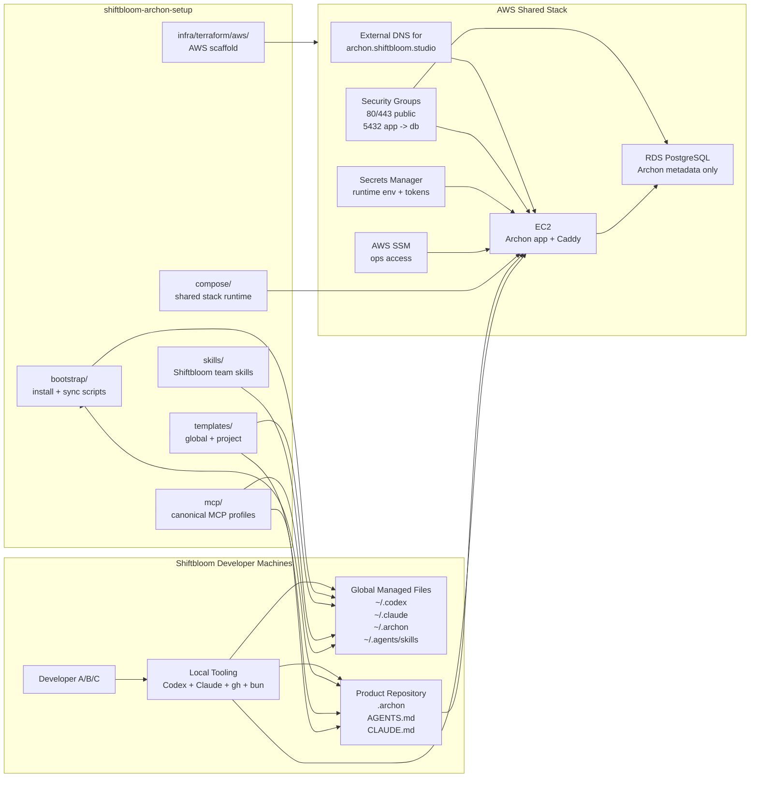

# Architecture

## Goal

Shiftbloom uses one shared Archon v2 foundation across repositories and developer machines so that workflows, instructions, MCP naming, and team skills stay consistent.

## Diagram

Current target topology:

- shared runtime on AWS EC2
- Archon metadata in RDS PostgreSQL
- runtime configuration in Secrets Manager
- operations through SSM
- external DNS mapped to `archon.shiftbloom.studio`

## Shared Stack

The shared stack runs on AWS and consists of:

- one EC2 instance for the Archon application runtime
- one RDS PostgreSQL instance for Archon metadata only
- one Secrets Manager secret containing runtime environment variables
- AWS SSM for operational access
- Caddy for HTTPS termination and MVP basic auth

The shared stack is intended for:

- shared demos
- long-running workflows
- PR and review orchestration
- team-visible execution and monitoring

It is not intended to replace local developer usage.

## Local Developer Setup

Each developer gets:

- a local Codex setup
- a local Claude setup
- a shared set of Shiftbloom skills
- the same MCP profile names
- the same project anchor files in product repositories

Local usage remains important for:

- exploratory work
- pair debugging
- repo-specific experimentation
- tasks that should stay inside personal credentials

## Repository Model

There are two distribution targets:

1. Product repositories:
   - `.archon/`
   - `AGENTS.md`
   - `CLAUDE.md`
2. Developer home directories:
   - `~/.codex/`
   - `~/.claude/`
   - `~/.archon/.archon/workflows/`
   - `~/.agents/skills/`

Distribution is copy/sync based so the setup works the same on macOS, Linux, and WSL2.

## MCP Strategy

Canonical profiles:

- `github`
- `postgres_ro`

Rules:

- use the same profile names in Codex and Claude
- keep `postgres_ro` read-only
- never use the Archon metadata database as a general application MCP target
- document Claude-first behavior for node-level Archon workflow MCP usage

## AI Credential Strategy

The setup uses a hybrid model:

- shared stack uses dedicated service accounts for Claude and Codex
- local developers authenticate with personal accounts

This keeps team automation stable while preserving individual ownership and developer flexibility.
